<html xmlns:o="urn:schemas-microsoft-com:office:office" xmlns:w="urn:schemas-microsoft-com:office:word" xmlns:dt="uuid:C2F41010-65B3-11d1-A29F-00AA00C14882" xmlns="http://www.w3.org/TR/REC-html40"><head><meta http-equiv=Content-Type  content="text/html; charset=gb2312" ><meta name=ProgId  content=Word.Document ><meta name=Generator  content="Microsoft Word 14" ><meta name=Originator  content="Microsoft Word 14" ><title></title><!--[if gte mso 9]><xml><o:DocumentProperties><o:Author>asus</o:Author><o:LastAuthor>珍儿珍，笑语繁</o:LastAuthor><o:Revision>1</o:Revision><o:Pages>1</o:Pages></o:DocumentProperties><o:CustomDocumentProperties><o:KSOProductBuildVer dt:dt="string" >2052-11.1.0.10314</o:KSOProductBuildVer></o:CustomDocumentProperties></xml><![endif]--><!--[if gte mso 9]><xml><o:OfficeDocumentSettings></o:OfficeDocumentSettings></xml><![endif]--><!--[if gte mso 9]><xml><w:WordDocument><w:BrowserLevel>MicrosoftInternetExplorer4</w:BrowserLevel><w:DisplayHorizontalDrawingGridEvery>0</w:DisplayHorizontalDrawingGridEvery><w:DisplayVerticalDrawingGridEvery>2</w:DisplayVerticalDrawingGridEvery><w:DocumentKind>DocumentNotSpecified</w:DocumentKind><w:DrawingGridVerticalSpacing>7.8 磅</w:DrawingGridVerticalSpacing><w:View>Web</w:View><w:Compatibility><w:DontGrowAutofit/><w:BalanceSingleByteDoubleByteWidth/><w:DoNotExpandShiftReturn/><w:UseFELayout/></w:Compatibility><w:Zoom>0</w:Zoom></w:WordDocument></xml><![endif]--><!--[if gte mso 9]><xml><w:LatentStyles DefLockedState="false"  DefUnhideWhenUsed="true"  DefSemiHidden="true"  DefQFormat="false"  DefPriority="99"  LatentStyleCount="260" >
<w:LsdException Locked="false"  Priority="0"  SemiHidden="false"  UnhideWhenUsed="false"  QFormat="true"  Name="Normal" ></w:LsdException>
<w:LsdException Locked="false"  Priority="0"  SemiHidden="false"  UnhideWhenUsed="false"  QFormat="true"  Name="heading 1" ></w:LsdException>
<w:LsdException Locked="false"  Priority="0"  SemiHidden="false"  QFormat="true"  Name="heading 2" ></w:LsdException>
<w:LsdException Locked="false"  Priority="0"  SemiHidden="false"  QFormat="true"  Name="heading 3" ></w:LsdException>
<w:LsdException Locked="false"  Priority="0"  SemiHidden="false"  QFormat="true"  Name="heading 4" ></w:LsdException>
<w:LsdException Locked="false"  Priority="0"  SemiHidden="false"  QFormat="true"  Name="heading 5" ></w:LsdException>
<w:LsdException Locked="false"  Priority="0"  SemiHidden="false"  QFormat="true"  Name="heading 6" ></w:LsdException>
<w:LsdException Locked="false"  Priority="0"  SemiHidden="false"  QFormat="true"  Name="heading 7" ></w:LsdException>
<w:LsdException Locked="false"  Priority="0"  SemiHidden="false"  QFormat="true"  Name="heading 8" ></w:LsdException>
<w:LsdException Locked="false"  Priority="0"  SemiHidden="false"  QFormat="true"  Name="heading 9" ></w:LsdException>
<w:LsdException Locked="false"  Priority="0"  SemiHidden="false"  UnhideWhenUsed="false"  Name="index 1" ></w:LsdException>
<w:LsdException Locked="false"  Priority="0"  SemiHidden="false"  UnhideWhenUsed="false"  Name="index 2" ></w:LsdException>
<w:LsdException Locked="false"  Priority="0"  SemiHidden="false"  UnhideWhenUsed="false"  Name="index 3" ></w:LsdException>
<w:LsdException Locked="false"  Priority="0"  SemiHidden="false"  UnhideWhenUsed="false"  Name="index 4" ></w:LsdException>
<w:LsdException Locked="false"  Priority="0"  SemiHidden="false"  UnhideWhenUsed="false"  Name="index 5" ></w:LsdException>
<w:LsdException Locked="false"  Priority="0"  SemiHidden="false"  UnhideWhenUsed="false"  Name="index 6" ></w:LsdException>
<w:LsdException Locked="false"  Priority="0"  SemiHidden="false"  UnhideWhenUsed="false"  Name="index 7" ></w:LsdException>
<w:LsdException Locked="false"  Priority="0"  SemiHidden="false"  UnhideWhenUsed="false"  Name="index 8" ></w:LsdException>
<w:LsdException Locked="false"  Priority="0"  SemiHidden="false"  UnhideWhenUsed="false"  Name="index 9" ></w:LsdException>
<w:LsdException Locked="false"  Priority="0"  SemiHidden="false"  UnhideWhenUsed="false"  Name="toc 1" ></w:LsdException>
<w:LsdException Locked="false"  Priority="0"  SemiHidden="false"  UnhideWhenUsed="false"  Name="toc 2" ></w:LsdException>
<w:LsdException Locked="false"  Priority="0"  SemiHidden="false"  UnhideWhenUsed="false"  Name="toc 3" ></w:LsdException>
<w:LsdException Locked="false"  Priority="0"  SemiHidden="false"  UnhideWhenUsed="false"  Name="toc 4" ></w:LsdException>
<w:LsdException Locked="false"  Priority="0"  SemiHidden="false"  UnhideWhenUsed="false"  Name="toc 5" ></w:LsdException>
<w:LsdException Locked="false"  Priority="0"  SemiHidden="false"  UnhideWhenUsed="false"  Name="toc 6" ></w:LsdException>
<w:LsdException Locked="false"  Priority="0"  SemiHidden="false"  UnhideWhenUsed="false"  Name="toc 7" ></w:LsdException>
<w:LsdException Locked="false"  Priority="0"  SemiHidden="false"  UnhideWhenUsed="false"  Name="toc 8" ></w:LsdException>
<w:LsdException Locked="false"  Priority="0"  SemiHidden="false"  UnhideWhenUsed="false"  Name="toc 9" ></w:LsdException>
<w:LsdException Locked="false"  Priority="0"  SemiHidden="false"  UnhideWhenUsed="false"  Name="Normal Indent" ></w:LsdException>
<w:LsdException Locked="false"  Priority="0"  SemiHidden="false"  UnhideWhenUsed="false"  Name="footnote text" ></w:LsdException>
<w:LsdException Locked="false"  Priority="0"  SemiHidden="false"  UnhideWhenUsed="false"  Name="annotation text" ></w:LsdException>
<w:LsdException Locked="false"  Priority="0"  SemiHidden="false"  UnhideWhenUsed="false"  Name="header" ></w:LsdException>
<w:LsdException Locked="false"  Priority="0"  SemiHidden="false"  UnhideWhenUsed="false"  Name="footer" ></w:LsdException>
<w:LsdException Locked="false"  Priority="0"  SemiHidden="false"  UnhideWhenUsed="false"  Name="index heading" ></w:LsdException>
<w:LsdException Locked="false"  Priority="0"  SemiHidden="false"  QFormat="true"  Name="caption" ></w:LsdException>
<w:LsdException Locked="false"  Priority="0"  SemiHidden="false"  UnhideWhenUsed="false"  Name="table of figures" ></w:LsdException>
<w:LsdException Locked="false"  Priority="0"  SemiHidden="false"  UnhideWhenUsed="false"  Name="envelope address" ></w:LsdException>
<w:LsdException Locked="false"  Priority="0"  SemiHidden="false"  UnhideWhenUsed="false"  Name="envelope return" ></w:LsdException>
<w:LsdException Locked="false"  Priority="0"  SemiHidden="false"  UnhideWhenUsed="false"  Name="footnote reference" ></w:LsdException>
<w:LsdException Locked="false"  Priority="0"  SemiHidden="false"  UnhideWhenUsed="false"  Name="annotation reference" ></w:LsdException>
<w:LsdException Locked="false"  Priority="0"  SemiHidden="false"  UnhideWhenUsed="false"  Name="line number" ></w:LsdException>
<w:LsdException Locked="false"  Priority="0"  SemiHidden="false"  UnhideWhenUsed="false"  Name="page number" ></w:LsdException>
<w:LsdException Locked="false"  Priority="0"  SemiHidden="false"  UnhideWhenUsed="false"  Name="endnote reference" ></w:LsdException>
<w:LsdException Locked="false"  Priority="0"  SemiHidden="false"  UnhideWhenUsed="false"  Name="endnote text" ></w:LsdException>
<w:LsdException Locked="false"  Priority="0"  SemiHidden="false"  UnhideWhenUsed="false"  Name="table of authorities" ></w:LsdException>
<w:LsdException Locked="false"  Priority="0"  SemiHidden="false"  UnhideWhenUsed="false"  Name="macro" ></w:LsdException>
<w:LsdException Locked="false"  Priority="0"  SemiHidden="false"  UnhideWhenUsed="false"  Name="toa heading" ></w:LsdException>
<w:LsdException Locked="false"  Priority="0"  SemiHidden="false"  UnhideWhenUsed="false"  Name="List" ></w:LsdException>
<w:LsdException Locked="false"  Priority="0"  SemiHidden="false"  UnhideWhenUsed="false"  Name="List Bullet" ></w:LsdException>
<w:LsdException Locked="false"  Priority="0"  SemiHidden="false"  UnhideWhenUsed="false"  Name="List Number" ></w:LsdException>
<w:LsdException Locked="false"  Priority="0"  SemiHidden="false"  UnhideWhenUsed="false"  Name="List 2" ></w:LsdException>
<w:LsdException Locked="false"  Priority="0"  SemiHidden="false"  UnhideWhenUsed="false"  Name="List 3" ></w:LsdException>
<w:LsdException Locked="false"  Priority="0"  SemiHidden="false"  UnhideWhenUsed="false"  Name="List 4" ></w:LsdException>
<w:LsdException Locked="false"  Priority="0"  SemiHidden="false"  UnhideWhenUsed="false"  Name="List 5" ></w:LsdException>
<w:LsdException Locked="false"  Priority="0"  SemiHidden="false"  UnhideWhenUsed="false"  Name="List Bullet 2" ></w:LsdException>
<w:LsdException Locked="false"  Priority="0"  SemiHidden="false"  UnhideWhenUsed="false"  Name="List Bullet 3" ></w:LsdException>
<w:LsdException Locked="false"  Priority="0"  SemiHidden="false"  UnhideWhenUsed="false"  Name="List Bullet 4" ></w:LsdException>
<w:LsdException Locked="false"  Priority="0"  SemiHidden="false"  UnhideWhenUsed="false"  Name="List Bullet 5" ></w:LsdException>
<w:LsdException Locked="false"  Priority="0"  SemiHidden="false"  UnhideWhenUsed="false"  Name="List Number 2" ></w:LsdException>
<w:LsdException Locked="false"  Priority="0"  SemiHidden="false"  UnhideWhenUsed="false"  Name="List Number 3" ></w:LsdException>
<w:LsdException Locked="false"  Priority="0"  SemiHidden="false"  UnhideWhenUsed="false"  Name="List Number 4" ></w:LsdException>
<w:LsdException Locked="false"  Priority="0"  SemiHidden="false"  UnhideWhenUsed="false"  Name="List Number 5" ></w:LsdException>
<w:LsdException Locked="false"  Priority="0"  SemiHidden="false"  UnhideWhenUsed="false"  QFormat="true"  Name="Title" ></w:LsdException>
<w:LsdException Locked="false"  Priority="0"  SemiHidden="false"  UnhideWhenUsed="false"  Name="Closing" ></w:LsdException>
<w:LsdException Locked="false"  Priority="0"  SemiHidden="false"  UnhideWhenUsed="false"  Name="Signature" ></w:LsdException>
<w:LsdException Locked="false"  Priority="0"  UnhideWhenUsed="false"  QFormat="true"  Name="Default Paragraph Font" ></w:LsdException>
<w:LsdException Locked="false"  Priority="0"  SemiHidden="false"  UnhideWhenUsed="false"  Name="Body Text" ></w:LsdException>
<w:LsdException Locked="false"  Priority="0"  SemiHidden="false"  UnhideWhenUsed="false"  Name="Body Text Indent" ></w:LsdException>
<w:LsdException Locked="false"  Priority="0"  SemiHidden="false"  UnhideWhenUsed="false"  Name="List Continue" ></w:LsdException>
<w:LsdException Locked="false"  Priority="0"  SemiHidden="false"  UnhideWhenUsed="false"  Name="List Continue 2" ></w:LsdException>
<w:LsdException Locked="false"  Priority="0"  SemiHidden="false"  UnhideWhenUsed="false"  Name="List Continue 3" ></w:LsdException>
<w:LsdException Locked="false"  Priority="0"  SemiHidden="false"  UnhideWhenUsed="false"  Name="List Continue 4" ></w:LsdException>
<w:LsdException Locked="false"  Priority="0"  SemiHidden="false"  UnhideWhenUsed="false"  Name="List Continue 5" ></w:LsdException>
<w:LsdException Locked="false"  Priority="0"  SemiHidden="false"  UnhideWhenUsed="false"  Name="Message Header" ></w:LsdException>
<w:LsdException Locked="false"  Priority="0"  SemiHidden="false"  UnhideWhenUsed="false"  QFormat="true"  Name="Subtitle" ></w:LsdException>
<w:LsdException Locked="false"  Priority="0"  SemiHidden="false"  UnhideWhenUsed="false"  Name="Salutation" ></w:LsdException>
<w:LsdException Locked="false"  Priority="0"  SemiHidden="false"  UnhideWhenUsed="false"  Name="Date" ></w:LsdException>
<w:LsdException Locked="false"  Priority="0"  SemiHidden="false"  UnhideWhenUsed="false"  Name="Body Text First Indent" ></w:LsdException>
<w:LsdException Locked="false"  Priority="0"  SemiHidden="false"  UnhideWhenUsed="false"  Name="Body Text First Indent 2" ></w:LsdException>
<w:LsdException Locked="false"  Priority="0"  SemiHidden="false"  UnhideWhenUsed="false"  Name="Note Heading" ></w:LsdException>
<w:LsdException Locked="false"  Priority="0"  SemiHidden="false"  UnhideWhenUsed="false"  Name="Body Text 2" ></w:LsdException>
<w:LsdException Locked="false"  Priority="0"  SemiHidden="false"  UnhideWhenUsed="false"  Name="Body Text 3" ></w:LsdException>
<w:LsdException Locked="false"  Priority="0"  SemiHidden="false"  UnhideWhenUsed="false"  Name="Body Text Indent 2" ></w:LsdException>
<w:LsdException Locked="false"  Priority="0"  SemiHidden="false"  UnhideWhenUsed="false"  Name="Body Text Indent 3" ></w:LsdException>
<w:LsdException Locked="false"  Priority="0"  SemiHidden="false"  UnhideWhenUsed="false"  Name="Block Text" ></w:LsdException>
<w:LsdException Locked="false"  Priority="0"  SemiHidden="false"  UnhideWhenUsed="false"  Name="Hyperlink" ></w:LsdException>
<w:LsdException Locked="false"  Priority="0"  SemiHidden="false"  UnhideWhenUsed="false"  Name="FollowedHyperlink" ></w:LsdException>
<w:LsdException Locked="false"  Priority="0"  SemiHidden="false"  UnhideWhenUsed="false"  QFormat="true"  Name="Strong" ></w:LsdException>
<w:LsdException Locked="false"  Priority="0"  SemiHidden="false"  UnhideWhenUsed="false"  QFormat="true"  Name="Emphasis" ></w:LsdException>
<w:LsdException Locked="false"  Priority="0"  SemiHidden="false"  UnhideWhenUsed="false"  Name="Document Map" ></w:LsdException>
<w:LsdException Locked="false"  Priority="0"  SemiHidden="false"  UnhideWhenUsed="false"  Name="Plain Text" ></w:LsdException>
<w:LsdException Locked="false"  Priority="0"  SemiHidden="false"  UnhideWhenUsed="false"  Name="E-mail Signature" ></w:LsdException>
<w:LsdException Locked="false"  Priority="0"  SemiHidden="false"  UnhideWhenUsed="false"  Name="Normal (Web)" ></w:LsdException>
<w:LsdException Locked="false"  Priority="0"  SemiHidden="false"  UnhideWhenUsed="false"  Name="HTML Acronym" ></w:LsdException>
<w:LsdException Locked="false"  Priority="0"  SemiHidden="false"  UnhideWhenUsed="false"  Name="HTML Address" ></w:LsdException>
<w:LsdException Locked="false"  Priority="0"  SemiHidden="false"  UnhideWhenUsed="false"  Name="HTML Cite" ></w:LsdException>
<w:LsdException Locked="false"  Priority="0"  SemiHidden="false"  UnhideWhenUsed="false"  Name="HTML Code" ></w:LsdException>
<w:LsdException Locked="false"  Priority="0"  SemiHidden="false"  UnhideWhenUsed="false"  Name="HTML Definition" ></w:LsdException>
<w:LsdException Locked="false"  Priority="0"  SemiHidden="false"  UnhideWhenUsed="false"  Name="HTML Keyboard" ></w:LsdException>
<w:LsdException Locked="false"  Priority="0"  SemiHidden="false"  UnhideWhenUsed="false"  Name="HTML Preformatted" ></w:LsdException>
<w:LsdException Locked="false"  Priority="0"  SemiHidden="false"  UnhideWhenUsed="false"  Name="HTML Sample" ></w:LsdException>
<w:LsdException Locked="false"  Priority="0"  SemiHidden="false"  UnhideWhenUsed="false"  Name="HTML Typewriter" ></w:LsdException>
<w:LsdException Locked="false"  Priority="0"  SemiHidden="false"  UnhideWhenUsed="false"  Name="HTML Variable" ></w:LsdException>
<w:LsdException Locked="false"  Priority="0"  UnhideWhenUsed="false"  Name="Normal Table" ></w:LsdException>
<w:LsdException Locked="false"  Priority="0"  SemiHidden="false"  UnhideWhenUsed="false"  Name="annotation subject" ></w:LsdException>
<w:LsdException Locked="false"  Priority="99"  SemiHidden="false"  Name="No List" ></w:LsdException>
<w:LsdException Locked="false"  Priority="99"  SemiHidden="false"  Name="1 / a / i" ></w:LsdException>
<w:LsdException Locked="false"  Priority="99"  SemiHidden="false"  Name="1 / 1.1 / 1.1.1" ></w:LsdException>
<w:LsdException Locked="false"  Priority="99"  SemiHidden="false"  Name="Article / Section" ></w:LsdException>
<w:LsdException Locked="false"  Priority="0"  SemiHidden="false"  UnhideWhenUsed="false"  Name="Table Simple 1" ></w:LsdException>
<w:LsdException Locked="false"  Priority="0"  SemiHidden="false"  UnhideWhenUsed="false"  Name="Table Simple 2" ></w:LsdException>
<w:LsdException Locked="false"  Priority="0"  SemiHidden="false"  UnhideWhenUsed="false"  Name="Table Simple 3" ></w:LsdException>
<w:LsdException Locked="false"  Priority="0"  SemiHidden="false"  UnhideWhenUsed="false"  Name="Table Classic 1" ></w:LsdException>
<w:LsdException Locked="false"  Priority="0"  SemiHidden="false"  UnhideWhenUsed="false"  Name="Table Classic 2" ></w:LsdException>
<w:LsdException Locked="false"  Priority="0"  SemiHidden="false"  UnhideWhenUsed="false"  Name="Table Classic 3" ></w:LsdException>
<w:LsdException Locked="false"  Priority="0"  SemiHidden="false"  UnhideWhenUsed="false"  Name="Table Classic 4" ></w:LsdException>
<w:LsdException Locked="false"  Priority="0"  SemiHidden="false"  UnhideWhenUsed="false"  Name="Table Colorful 1" ></w:LsdException>
<w:LsdException Locked="false"  Priority="0"  SemiHidden="false"  UnhideWhenUsed="false"  Name="Table Colorful 2" ></w:LsdException>
<w:LsdException Locked="false"  Priority="0"  SemiHidden="false"  UnhideWhenUsed="false"  Name="Table Colorful 3" ></w:LsdException>
<w:LsdException Locked="false"  Priority="0"  SemiHidden="false"  UnhideWhenUsed="false"  Name="Table Columns 1" ></w:LsdException>
<w:LsdException Locked="false"  Priority="0"  SemiHidden="false"  UnhideWhenUsed="false"  Name="Table Columns 2" ></w:LsdException>
<w:LsdException Locked="false"  Priority="0"  SemiHidden="false"  UnhideWhenUsed="false"  Name="Table Columns 3" ></w:LsdException>
<w:LsdException Locked="false"  Priority="0"  SemiHidden="false"  UnhideWhenUsed="false"  Name="Table Columns 4" ></w:LsdException>
<w:LsdException Locked="false"  Priority="0"  SemiHidden="false"  UnhideWhenUsed="false"  Name="Table Columns 5" ></w:LsdException>
<w:LsdException Locked="false"  Priority="0"  SemiHidden="false"  UnhideWhenUsed="false"  Name="Table Grid 1" ></w:LsdException>
<w:LsdException Locked="false"  Priority="0"  SemiHidden="false"  UnhideWhenUsed="false"  Name="Table Grid 2" ></w:LsdException>
<w:LsdException Locked="false"  Priority="0"  SemiHidden="false"  UnhideWhenUsed="false"  Name="Table Grid 3" ></w:LsdException>
<w:LsdException Locked="false"  Priority="0"  SemiHidden="false"  UnhideWhenUsed="false"  Name="Table Grid 4" ></w:LsdException>
<w:LsdException Locked="false"  Priority="0"  SemiHidden="false"  UnhideWhenUsed="false"  Name="Table Grid 5" ></w:LsdException>
<w:LsdException Locked="false"  Priority="0"  SemiHidden="false"  UnhideWhenUsed="false"  Name="Table Grid 6" ></w:LsdException>
<w:LsdException Locked="false"  Priority="0"  SemiHidden="false"  UnhideWhenUsed="false"  Name="Table Grid 7" ></w:LsdException>
<w:LsdException Locked="false"  Priority="0"  SemiHidden="false"  UnhideWhenUsed="false"  Name="Table Grid 8" ></w:LsdException>
<w:LsdException Locked="false"  Priority="0"  SemiHidden="false"  UnhideWhenUsed="false"  Name="Table List 1" ></w:LsdException>
<w:LsdException Locked="false"  Priority="0"  SemiHidden="false"  UnhideWhenUsed="false"  Name="Table List 2" ></w:LsdException>
<w:LsdException Locked="false"  Priority="0"  SemiHidden="false"  UnhideWhenUsed="false"  Name="Table List 3" ></w:LsdException>
<w:LsdException Locked="false"  Priority="0"  SemiHidden="false"  UnhideWhenUsed="false"  Name="Table List 4" ></w:LsdException>
<w:LsdException Locked="false"  Priority="0"  SemiHidden="false"  UnhideWhenUsed="false"  Name="Table List 5" ></w:LsdException>
<w:LsdException Locked="false"  Priority="0"  SemiHidden="false"  UnhideWhenUsed="false"  Name="Table List 6" ></w:LsdException>
<w:LsdException Locked="false"  Priority="0"  SemiHidden="false"  UnhideWhenUsed="false"  Name="Table List 7" ></w:LsdException>
<w:LsdException Locked="false"  Priority="0"  SemiHidden="false"  UnhideWhenUsed="false"  Name="Table List 8" ></w:LsdException>
<w:LsdException Locked="false"  Priority="0"  SemiHidden="false"  UnhideWhenUsed="false"  Name="Table 3D effects 1" ></w:LsdException>
<w:LsdException Locked="false"  Priority="0"  SemiHidden="false"  UnhideWhenUsed="false"  Name="Table 3D effects 2" ></w:LsdException>
<w:LsdException Locked="false"  Priority="0"  SemiHidden="false"  UnhideWhenUsed="false"  Name="Table 3D effects 3" ></w:LsdException>
<w:LsdException Locked="false"  Priority="0"  SemiHidden="false"  UnhideWhenUsed="false"  Name="Table Contemporary" ></w:LsdException>
<w:LsdException Locked="false"  Priority="0"  SemiHidden="false"  UnhideWhenUsed="false"  Name="Table Elegant" ></w:LsdException>
<w:LsdException Locked="false"  Priority="0"  SemiHidden="false"  UnhideWhenUsed="false"  Name="Table Professional" ></w:LsdException>
<w:LsdException Locked="false"  Priority="0"  SemiHidden="false"  UnhideWhenUsed="false"  Name="Table Subtle 1" ></w:LsdException>
<w:LsdException Locked="false"  Priority="0"  SemiHidden="false"  UnhideWhenUsed="false"  Name="Table Subtle 2" ></w:LsdException>
<w:LsdException Locked="false"  Priority="0"  SemiHidden="false"  UnhideWhenUsed="false"  Name="Table Web 1" ></w:LsdException>
<w:LsdException Locked="false"  Priority="0"  SemiHidden="false"  UnhideWhenUsed="false"  Name="Table Web 2" ></w:LsdException>
<w:LsdException Locked="false"  Priority="0"  SemiHidden="false"  UnhideWhenUsed="false"  Name="Table Web 3" ></w:LsdException>
<w:LsdException Locked="false"  Priority="0"  SemiHidden="false"  UnhideWhenUsed="false"  Name="Balloon Text" ></w:LsdException>
<w:LsdException Locked="false"  Priority="0"  SemiHidden="false"  UnhideWhenUsed="false"  Name="Table Grid" ></w:LsdException>
<w:LsdException Locked="false"  Priority="0"  SemiHidden="false"  UnhideWhenUsed="false"  Name="Table Theme" ></w:LsdException>
<w:LsdException Locked="false"  Priority="99"  SemiHidden="false"  Name="Placeholder Text" ></w:LsdException>
<w:LsdException Locked="false"  Priority="99"  SemiHidden="false"  Name="No Spacing" ></w:LsdException>
<w:LsdException Locked="false"  Priority="60"  SemiHidden="false"  UnhideWhenUsed="false"  Name="Light Shading" ></w:LsdException>
<w:LsdException Locked="false"  Priority="61"  SemiHidden="false"  UnhideWhenUsed="false"  Name="Light List" ></w:LsdException>
<w:LsdException Locked="false"  Priority="62"  SemiHidden="false"  UnhideWhenUsed="false"  Name="Light Grid" ></w:LsdException>
<w:LsdException Locked="false"  Priority="63"  SemiHidden="false"  UnhideWhenUsed="false"  Name="Medium Shading 1" ></w:LsdException>
<w:LsdException Locked="false"  Priority="64"  SemiHidden="false"  UnhideWhenUsed="false"  Name="Medium Shading 2" ></w:LsdException>
<w:LsdException Locked="false"  Priority="65"  SemiHidden="false"  UnhideWhenUsed="false"  Name="Medium List 1" ></w:LsdException>
<w:LsdException Locked="false"  Priority="66"  SemiHidden="false"  UnhideWhenUsed="false"  Name="Medium List 2" ></w:LsdException>
<w:LsdException Locked="false"  Priority="67"  SemiHidden="false"  UnhideWhenUsed="false"  Name="Medium Grid 1" ></w:LsdException>
<w:LsdException Locked="false"  Priority="68"  SemiHidden="false"  UnhideWhenUsed="false"  Name="Medium Grid 2" ></w:LsdException>
<w:LsdException Locked="false"  Priority="69"  SemiHidden="false"  UnhideWhenUsed="false"  Name="Medium Grid 3" ></w:LsdException>
<w:LsdException Locked="false"  Priority="70"  SemiHidden="false"  UnhideWhenUsed="false"  Name="Dark List" ></w:LsdException>
<w:LsdException Locked="false"  Priority="71"  SemiHidden="false"  UnhideWhenUsed="false"  Name="Colorful Shading" ></w:LsdException>
<w:LsdException Locked="false"  Priority="72"  SemiHidden="false"  UnhideWhenUsed="false"  Name="Colorful List" ></w:LsdException>
<w:LsdException Locked="false"  Priority="73"  SemiHidden="false"  UnhideWhenUsed="false"  Name="Colorful Grid" ></w:LsdException>
<w:LsdException Locked="false"  Priority="60"  SemiHidden="false"  UnhideWhenUsed="false"  Name="Light Shading Accent 1" ></w:LsdException>
<w:LsdException Locked="false"  Priority="61"  SemiHidden="false"  UnhideWhenUsed="false"  Name="Light List Accent 1" ></w:LsdException>
<w:LsdException Locked="false"  Priority="62"  SemiHidden="false"  UnhideWhenUsed="false"  Name="Light Grid Accent 1" ></w:LsdException>
<w:LsdException Locked="false"  Priority="63"  SemiHidden="false"  UnhideWhenUsed="false"  Name="Medium Shading 1 Accent 1" ></w:LsdException>
<w:LsdException Locked="false"  Priority="64"  SemiHidden="false"  UnhideWhenUsed="false"  Name="Medium Shading 2 Accent 1" ></w:LsdException>
<w:LsdException Locked="false"  Priority="65"  SemiHidden="false"  UnhideWhenUsed="false"  Name="Medium List 1 Accent 1" ></w:LsdException>
<w:LsdException Locked="false"  Priority="99"  SemiHidden="false"  Name="List Paragraph" ></w:LsdException>
<w:LsdException Locked="false"  Priority="99"  SemiHidden="false"  Name="Quote" ></w:LsdException>
<w:LsdException Locked="false"  Priority="99"  SemiHidden="false"  Name="Intense Quote" ></w:LsdException>
<w:LsdException Locked="false"  Priority="66"  SemiHidden="false"  UnhideWhenUsed="false"  Name="Medium List 2 Accent 1" ></w:LsdException>
<w:LsdException Locked="false"  Priority="67"  SemiHidden="false"  UnhideWhenUsed="false"  Name="Medium Grid 1 Accent 1" ></w:LsdException>
<w:LsdException Locked="false"  Priority="68"  SemiHidden="false"  UnhideWhenUsed="false"  Name="Medium Grid 2 Accent 1" ></w:LsdException>
<w:LsdException Locked="false"  Priority="69"  SemiHidden="false"  UnhideWhenUsed="false"  Name="Medium Grid 3 Accent 1" ></w:LsdException>
<w:LsdException Locked="false"  Priority="70"  SemiHidden="false"  UnhideWhenUsed="false"  Name="Dark List Accent 1" ></w:LsdException>
<w:LsdException Locked="false"  Priority="71"  SemiHidden="false"  UnhideWhenUsed="false"  Name="Colorful Shading Accent 1" ></w:LsdException>
<w:LsdException Locked="false"  Priority="72"  SemiHidden="false"  UnhideWhenUsed="false"  Name="Colorful List Accent 1" ></w:LsdException>
<w:LsdException Locked="false"  Priority="73"  SemiHidden="false"  UnhideWhenUsed="false"  Name="Colorful Grid Accent 1" ></w:LsdException>
<w:LsdException Locked="false"  Priority="60"  SemiHidden="false"  UnhideWhenUsed="false"  Name="Light Shading Accent 2" ></w:LsdException>
<w:LsdException Locked="false"  Priority="61"  SemiHidden="false"  UnhideWhenUsed="false"  Name="Light List Accent 2" ></w:LsdException>
<w:LsdException Locked="false"  Priority="62"  SemiHidden="false"  UnhideWhenUsed="false"  Name="Light Grid Accent 2" ></w:LsdException>
<w:LsdException Locked="false"  Priority="63"  SemiHidden="false"  UnhideWhenUsed="false"  Name="Medium Shading 1 Accent 2" ></w:LsdException>
<w:LsdException Locked="false"  Priority="64"  SemiHidden="false"  UnhideWhenUsed="false"  Name="Medium Shading 2 Accent 2" ></w:LsdException>
<w:LsdException Locked="false"  Priority="65"  SemiHidden="false"  UnhideWhenUsed="false"  Name="Medium List 1 Accent 2" ></w:LsdException>
<w:LsdException Locked="false"  Priority="66"  SemiHidden="false"  UnhideWhenUsed="false"  Name="Medium List 2 Accent 2" ></w:LsdException>
<w:LsdException Locked="false"  Priority="67"  SemiHidden="false"  UnhideWhenUsed="false"  Name="Medium Grid 1 Accent 2" ></w:LsdException>
<w:LsdException Locked="false"  Priority="68"  SemiHidden="false"  UnhideWhenUsed="false"  Name="Medium Grid 2 Accent 2" ></w:LsdException>
<w:LsdException Locked="false"  Priority="69"  SemiHidden="false"  UnhideWhenUsed="false"  Name="Medium Grid 3 Accent 2" ></w:LsdException>
<w:LsdException Locked="false"  Priority="70"  SemiHidden="false"  UnhideWhenUsed="false"  Name="Dark List Accent 2" ></w:LsdException>
<w:LsdException Locked="false"  Priority="71"  SemiHidden="false"  UnhideWhenUsed="false"  Name="Colorful Shading Accent 2" ></w:LsdException>
<w:LsdException Locked="false"  Priority="72"  SemiHidden="false"  UnhideWhenUsed="false"  Name="Colorful List Accent 2" ></w:LsdException>
<w:LsdException Locked="false"  Priority="73"  SemiHidden="false"  UnhideWhenUsed="false"  Name="Colorful Grid Accent 2" ></w:LsdException>
<w:LsdException Locked="false"  Priority="60"  SemiHidden="false"  UnhideWhenUsed="false"  Name="Light Shading Accent 3" ></w:LsdException>
<w:LsdException Locked="false"  Priority="61"  SemiHidden="false"  UnhideWhenUsed="false"  Name="Light List Accent 3" ></w:LsdException>
<w:LsdException Locked="false"  Priority="62"  SemiHidden="false"  UnhideWhenUsed="false"  Name="Light Grid Accent 3" ></w:LsdException>
<w:LsdException Locked="false"  Priority="63"  SemiHidden="false"  UnhideWhenUsed="false"  Name="Medium Shading 1 Accent 3" ></w:LsdException>
<w:LsdException Locked="false"  Priority="64"  SemiHidden="false"  UnhideWhenUsed="false"  Name="Medium Shading 2 Accent 3" ></w:LsdException>
<w:LsdException Locked="false"  Priority="65"  SemiHidden="false"  UnhideWhenUsed="false"  Name="Medium List 1 Accent 3" ></w:LsdException>
<w:LsdException Locked="false"  Priority="66"  SemiHidden="false"  UnhideWhenUsed="false"  Name="Medium List 2 Accent 3" ></w:LsdException>
<w:LsdException Locked="false"  Priority="67"  SemiHidden="false"  UnhideWhenUsed="false"  Name="Medium Grid 1 Accent 3" ></w:LsdException>
<w:LsdException Locked="false"  Priority="68"  SemiHidden="false"  UnhideWhenUsed="false"  Name="Medium Grid 2 Accent 3" ></w:LsdException>
<w:LsdException Locked="false"  Priority="69"  SemiHidden="false"  UnhideWhenUsed="false"  Name="Medium Grid 3 Accent 3" ></w:LsdException>
<w:LsdException Locked="false"  Priority="70"  SemiHidden="false"  UnhideWhenUsed="false"  Name="Dark List Accent 3" ></w:LsdException>
<w:LsdException Locked="false"  Priority="71"  SemiHidden="false"  UnhideWhenUsed="false"  Name="Colorful Shading Accent 3" ></w:LsdException>
<w:LsdException Locked="false"  Priority="72"  SemiHidden="false"  UnhideWhenUsed="false"  Name="Colorful List Accent 3" ></w:LsdException>
<w:LsdException Locked="false"  Priority="73"  SemiHidden="false"  UnhideWhenUsed="false"  Name="Colorful Grid Accent 3" ></w:LsdException>
<w:LsdException Locked="false"  Priority="60"  SemiHidden="false"  UnhideWhenUsed="false"  Name="Light Shading Accent 4" ></w:LsdException>
<w:LsdException Locked="false"  Priority="61"  SemiHidden="false"  UnhideWhenUsed="false"  Name="Light List Accent 4" ></w:LsdException>
<w:LsdException Locked="false"  Priority="62"  SemiHidden="false"  UnhideWhenUsed="false"  Name="Light Grid Accent 4" ></w:LsdException>
<w:LsdException Locked="false"  Priority="63"  SemiHidden="false"  UnhideWhenUsed="false"  Name="Medium Shading 1 Accent 4" ></w:LsdException>
<w:LsdException Locked="false"  Priority="64"  SemiHidden="false"  UnhideWhenUsed="false"  Name="Medium Shading 2 Accent 4" ></w:LsdException>
<w:LsdException Locked="false"  Priority="65"  SemiHidden="false"  UnhideWhenUsed="false"  Name="Medium List 1 Accent 4" ></w:LsdException>
<w:LsdException Locked="false"  Priority="66"  SemiHidden="false"  UnhideWhenUsed="false"  Name="Medium List 2 Accent 4" ></w:LsdException>
<w:LsdException Locked="false"  Priority="67"  SemiHidden="false"  UnhideWhenUsed="false"  Name="Medium Grid 1 Accent 4" ></w:LsdException>
<w:LsdException Locked="false"  Priority="68"  SemiHidden="false"  UnhideWhenUsed="false"  Name="Medium Grid 2 Accent 4" ></w:LsdException>
<w:LsdException Locked="false"  Priority="69"  SemiHidden="false"  UnhideWhenUsed="false"  Name="Medium Grid 3 Accent 4" ></w:LsdException>
<w:LsdException Locked="false"  Priority="70"  SemiHidden="false"  UnhideWhenUsed="false"  Name="Dark List Accent 4" ></w:LsdException>
<w:LsdException Locked="false"  Priority="71"  SemiHidden="false"  UnhideWhenUsed="false"  Name="Colorful Shading Accent 4" ></w:LsdException>
<w:LsdException Locked="false"  Priority="72"  SemiHidden="false"  UnhideWhenUsed="false"  Name="Colorful List Accent 4" ></w:LsdException>
<w:LsdException Locked="false"  Priority="73"  SemiHidden="false"  UnhideWhenUsed="false"  Name="Colorful Grid Accent 4" ></w:LsdException>
<w:LsdException Locked="false"  Priority="60"  SemiHidden="false"  UnhideWhenUsed="false"  Name="Light Shading Accent 5" ></w:LsdException>
<w:LsdException Locked="false"  Priority="61"  SemiHidden="false"  UnhideWhenUsed="false"  Name="Light List Accent 5" ></w:LsdException>
<w:LsdException Locked="false"  Priority="62"  SemiHidden="false"  UnhideWhenUsed="false"  Name="Light Grid Accent 5" ></w:LsdException>
<w:LsdException Locked="false"  Priority="63"  SemiHidden="false"  UnhideWhenUsed="false"  Name="Medium Shading 1 Accent 5" ></w:LsdException>
<w:LsdException Locked="false"  Priority="64"  SemiHidden="false"  UnhideWhenUsed="false"  Name="Medium Shading 2 Accent 5" ></w:LsdException>
<w:LsdException Locked="false"  Priority="65"  SemiHidden="false"  UnhideWhenUsed="false"  Name="Medium List 1 Accent 5" ></w:LsdException>
<w:LsdException Locked="false"  Priority="66"  SemiHidden="false"  UnhideWhenUsed="false"  Name="Medium List 2 Accent 5" ></w:LsdException>
<w:LsdException Locked="false"  Priority="67"  SemiHidden="false"  UnhideWhenUsed="false"  Name="Medium Grid 1 Accent 5" ></w:LsdException>
<w:LsdException Locked="false"  Priority="68"  SemiHidden="false"  UnhideWhenUsed="false"  Name="Medium Grid 2 Accent 5" ></w:LsdException>
<w:LsdException Locked="false"  Priority="69"  SemiHidden="false"  UnhideWhenUsed="false"  Name="Medium Grid 3 Accent 5" ></w:LsdException>
<w:LsdException Locked="false"  Priority="70"  SemiHidden="false"  UnhideWhenUsed="false"  Name="Dark List Accent 5" ></w:LsdException>
<w:LsdException Locked="false"  Priority="71"  SemiHidden="false"  UnhideWhenUsed="false"  Name="Colorful Shading Accent 5" ></w:LsdException>
<w:LsdException Locked="false"  Priority="72"  SemiHidden="false"  UnhideWhenUsed="false"  Name="Colorful List Accent 5" ></w:LsdException>
<w:LsdException Locked="false"  Priority="73"  SemiHidden="false"  UnhideWhenUsed="false"  Name="Colorful Grid Accent 5" ></w:LsdException>
<w:LsdException Locked="false"  Priority="60"  SemiHidden="false"  UnhideWhenUsed="false"  Name="Light Shading Accent 6" ></w:LsdException>
<w:LsdException Locked="false"  Priority="61"  SemiHidden="false"  UnhideWhenUsed="false"  Name="Light List Accent 6" ></w:LsdException>
<w:LsdException Locked="false"  Priority="62"  SemiHidden="false"  UnhideWhenUsed="false"  Name="Light Grid Accent 6" ></w:LsdException>
<w:LsdException Locked="false"  Priority="63"  SemiHidden="false"  UnhideWhenUsed="false"  Name="Medium Shading 1 Accent 6" ></w:LsdException>
<w:LsdException Locked="false"  Priority="64"  SemiHidden="false"  UnhideWhenUsed="false"  Name="Medium Shading 2 Accent 6" ></w:LsdException>
<w:LsdException Locked="false"  Priority="65"  SemiHidden="false"  UnhideWhenUsed="false"  Name="Medium List 1 Accent 6" ></w:LsdException>
<w:LsdException Locked="false"  Priority="66"  SemiHidden="false"  UnhideWhenUsed="false"  Name="Medium List 2 Accent 6" ></w:LsdException>
<w:LsdException Locked="false"  Priority="67"  SemiHidden="false"  UnhideWhenUsed="false"  Name="Medium Grid 1 Accent 6" ></w:LsdException>
<w:LsdException Locked="false"  Priority="68"  SemiHidden="false"  UnhideWhenUsed="false"  Name="Medium Grid 2 Accent 6" ></w:LsdException>
<w:LsdException Locked="false"  Priority="69"  SemiHidden="false"  UnhideWhenUsed="false"  Name="Medium Grid 3 Accent 6" ></w:LsdException>
<w:LsdException Locked="false"  Priority="70"  SemiHidden="false"  UnhideWhenUsed="false"  Name="Dark List Accent 6" ></w:LsdException>
<w:LsdException Locked="false"  Priority="71"  SemiHidden="false"  UnhideWhenUsed="false"  Name="Colorful Shading Accent 6" ></w:LsdException>
<w:LsdException Locked="false"  Priority="72"  SemiHidden="false"  UnhideWhenUsed="false"  Name="Colorful List Accent 6" ></w:LsdException>
<w:LsdException Locked="false"  Priority="73"  SemiHidden="false"  UnhideWhenUsed="false"  Name="Colorful Grid Accent 6" ></w:LsdException>
</w:LatentStyles></xml><![endif]--></head><body style="tab-interval:21pt;text-justify-trim:punctuation;" ><!--StartFragment-->

<b>DIFFICULTIES OF TRANSLATION</b><b><o:p></o:p></b>

<b>I</b><b>n Cities</b><b><o:p></o:p></b>

The city not only tells a story, but also has an infinite number of interpretations.&#160;And, of course, it is inclusive: accessible to people with different disabilities and helps to reveal the characteristics of different people.&#160;The object should be seen by those who cannot see, heard by those who cannot hear, touched by those who do not have such a physical ability.&#160;It is important for us to show how we are all alike, despite our differences, and how we can understand each other without looking at the difficulties of translation.<o:p></o:p>

<o:p>&nbsp;</o:p>

<b>What is Inclusion?&#160;</b><b><o:p></o:p></b>

<o:p>&nbsp;</o:p>

It is equal access for all, a space of mutual respect and understanding.&#160;Inclusion is a complex process aimed at a simple result - expanding your range of vision, the ability and joy to live in a society of people completely different from each other.&#160;This process is impossible both without an accessible environment and without setting up the context for understanding and accepting the other person.<o:p></o:p>

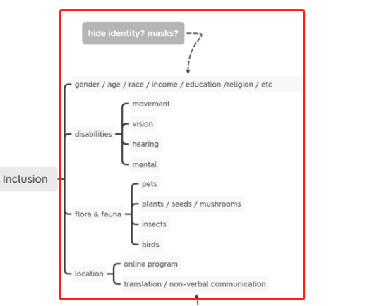<o:p>&nbsp;</o:p>

<b>Economic issue</b><b><o:p></o:p></b>

Amsterdam Is Embracing a Radical New Economic Theory to Help Save the Environment. Could It Also Replace Capitalism?<o:p></o:p>

<b>The doughnut model</b><b><o:p></o:p></b>

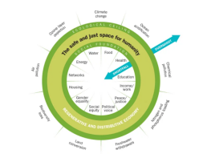<b>Inner Ring:</b>&nbsp;Twelve essentials of life that no one in society should be deprived of; <o:p></o:p>

<o:p>&nbsp;</o:p>

<b>Outer Ring:</b>&nbsp;Nine ecological limits of earth&#8217;s life-&#173;supporting systems that humanity must not collectively overshoot; <o:p></o:p>

<b>Sweet Spot: </b>The space both environmentally safe and socially just where humanity can thrive<o:p></o:p>

<o:p>&nbsp;</o:p>

<a href="https://time.com/5930093/amsterdam-doughnut-economics/?fbclid=IwAR2sit0RP2dqXDTsuB_HTqvRzNKN9Um9sZj9C-BVnu3m1VbCYqJDn0a6oHc" ><u>https://time.com/5930093/amsterdam-doughnut-economics/?fbclid=IwAR2sit0RP2dqXDTsuB_HTqvRzNKN9Um9sZj9C-BVnu3m1VbCYqJDn0a6oHc</u></a><o:p></o:p>

<u>Quote an example from the article</u>. &#8220;The new, doughnut-shaped world Amsterdam wants to build is coming into view on the southeastern side of the city. Rising almost 15 ft. out of placid waters of Lake IJssel lies the city&#8217;s latest flagship construction project, Strandeiland (Beach Island). Part of IJburg, an archipelago of six new islands built by city contractors, Beach Island was reclaimed from the waters with sand carried by boats run on low-emission fuel. The foundations were laid using processes that don&#8217;t hurt local wildlife or expose future residents to sea-level rise. Its future neighborhood is designed to produce zero emissions and to prioritize social housing and access to nature.&#8221;<o:p></o:p>

<o:p>&nbsp;</o:p>

<b>Ecological theory-</b><b>Permatopia</b><b>&nbsp;(permaculture)</b><b><o:p></o:p></b>

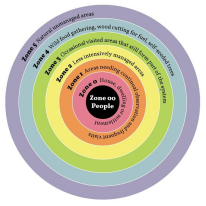<o:p>&nbsp;</o:p>

<a href="https://awakenfreedom.weebly.com/sustain--thrive.html" ><u>https://awakenfreedom.weebly.com/sustain--thrive.html</u></a><o:p></o:p>

<o:p>&nbsp;</o:p>
<h1><b>LOOK: Symphony {for} all</b><b>&nbsp;</b><b><o:p></o:p></b></h1>
<b>The object is kind of mixed instruments played by people</b><b>&#8217;</b><b>s experiments</b><b><o:p></o:p></b>

<b>Music</b><b>&nbsp;</b><b>of Sphere</b><b><o:p></o:p></b>

<b>music of spheres is an ancient artistic interpretation of the cosmos harmony. in stars vibration, size, colour, position - the silent 'music' is found. as a pure spiritual experience, it is accessible to everyone and requires no translation.</b><b><o:p></o:p></b>

<b>can we improvise a symphony of all of us?</b><b><o:p></o:p></b>

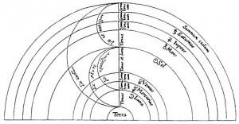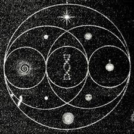<o:p>&nbsp;</o:p>

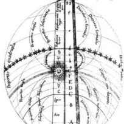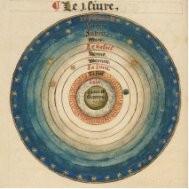<o:p>&nbsp;</o:p>

<a href="http://www.sensorystudies.org/picture-gallery/spheres_image/" ><u>http://www.sensorystudies.org/picture-gallery/spheres_image/</u></a><u><o:p></o:p></u>

<o:p>&nbsp;</o:p>

They affect each other like violin and piano affect each other in a philharmonic orchestra - indirectly. <o:p></o:p>

<o:p>&nbsp;</o:p>

<b>Planet of many spheres</b><b><o:p></o:p></b>

we all live together on one planet - but to coexist peacefully, there are different interconnected layers on earth (lithosphere and atmosphere, biosphere and infosphere). how can our object reflect this cosmological harmony?<o:p></o:p>

<o:p>&nbsp;</o:p>

<b>Definition of the object</b><b><o:p></o:p></b>

The&nbsp;object redefines the unprecedented collective experience of pandemic 2020 and expands our understanding of the universe in an act of improvisation.&nbsp;Symphony for Everyone is a complex multi-dimensional object, incorporating not only three layers of material embodiment, but also a musical-algorithmic broadcast, existing at the intersection of offline and online worlds, activated by visitors and natural elements. Its rotating spheres and spectral light programme - Music of the Spheres - reflect the harmony of the world order.<o:p></o:p>

<o:p>&nbsp;</o:p>

<b>Layers</b><b><o:p></o:p></b>

<![if !supportLists]>1.&nbsp;<![endif]><b>Isolation</b><b>&nbsp;(TOUCH + HEARING + SMELL)</b><b><o:p></o:p></b>

In the heart of the object&nbsp;there is a swing - a space for the one person. Anyone can have a <o:p></o:p>

rest there, isolating themselves from the environment. A crib, an eggshell&nbsp;or a womb - this is from <o:p></o:p>

where everything begins.<o:p></o:p>

<o:p>&nbsp;</o:p>

<![if !supportLists]>2.&nbsp;<![endif]><b>Connection(TOUCH + SIGHT)</b><b><o:p></o:p></b>

Shingle facade on the second layer is the medium for communication between visitors. By removing tiles, players can send messages in a binary code. When writing with UV markers, they can leave their secret signs, revealed at night. These shingles can be sent as postcards.<o:p></o:p>

<o:p>&nbsp;</o:p>

Using binary code&nbsp;as a means of transferring information between means of transferring information between park visitors.<o:p></o:p>

<o:p>&nbsp;</o:p>

Shingles are mostly roofing material in the form of slats, roofing material in the form of slats made of wood.<o:p></o:p>

<o:p>&nbsp;</o:p>

<![if !supportLists]>3.&nbsp;<![endif]><b>Interference(TOUCH + SIGHT)</b><b><o:p></o:p></b>

The third level connects us with nature. Revolving spheres create a unique moire optical effect <o:p></o:p>

pattern according to their and light relative position. Tiny elements, wobbling in the wind, make <o:p></o:p>

a background sound atmosphere.<o:p></o:p>

<b><o:p>&nbsp;</o:p></b>

<![if !supportLists]>4.&nbsp;<![endif]><b>Universal inclusion</b><b><o:p></o:p></b>

Using the online sound generating algorithm, ambient music is generated according to relative position of spheres and shingles messages. As live video streaming became the hottest media of this year, LOOK breaks into it!<o:p></o:p>

Now, anyone with a smartphone will see and hear the city breath: playing people and growing forest around.<o:p></o:p>

<b><o:p>&nbsp;</o:p></b>

<![if !supportLists]>5.&nbsp;<![endif]><b>The spread of the outdoor museum (nature museum)</b><b><o:p></o:p></b>

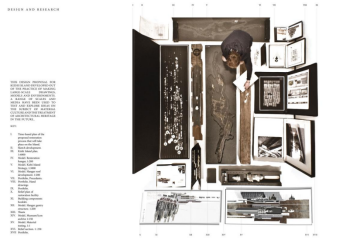<o:p>&nbsp;</o:p>

（poetic, a bit painful and extremely beautiful）<o:p></o:p>

<o:p>&nbsp;</o:p>

<b><o:p>&nbsp;</o:p></b>

<b>Dynamic pavilion configurations</b><b><o:p></o:p></b>

<o:p>&nbsp;</o:p>

In closed modes installation works as a private space, covering visitors from rain, and becoming <o:p></o:p>

a stage when opened.&nbsp;Revolving spheres create a unique moire optical effect pattern according to their and light relative position. <o:p></o:p>

<o:p>&nbsp;</o:p>

<b>Light for all</b><b><o:p></o:p></b>

there is so much of this world passes without human comprehension. For instance, we notice only tiny amount of spectrum, but our inclusive object goes beyond the human visual ability. half an hour after sunset the visual spectacle on solar batteries begins.<o:p></o:p>

<o:p>&nbsp;</o:p>

messages, written by the special paint, only become visible in uv light, and also it kills harmful bacteria inside.<o:p></o:p>

<o:p>&nbsp;</o:p>

-Infrared light<o:p></o:p>

Infrared light stimulates the growth of plants around the pavilion<o:p></o:p>

<a href="https://www.dezeen.com/2021/01/18/daan-roosegaarde-grow-light-installation-sustainable-agriculture/?fbclid=IwAR27PSeESnEr-e_6wTA8TeA5_3UP8_avMesF4dY37-txRvS76vpFPCiGlmA" ><u>https://www.dezeen.com/2021/01/18/daan-roosegaarde-grow-light-installation-sustainable-agriculture/?fbclid=IwAR27PSeESnEr-e_6wTA8TeA5_3UP8_avMesF4dY37-txRvS76vpFPCiGlmA</u></a><o:p></o:p>

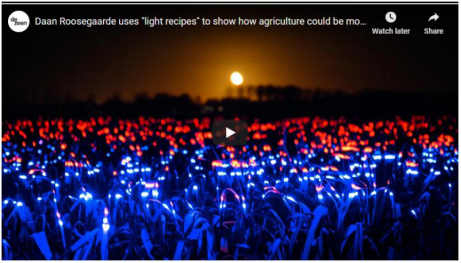<o:p>&nbsp;</o:p>

The Rotterdam-based studio, led by designer&#160;Daan Roosegaarde, used red, blue and ultraviolet lights&#160;to transform a field into a&#160;dynamic artwork.<o:p></o:p>

As well as creating a visual spectacle, the installation serves as a prototype for how certain "light recipes" can be used to increase plant growth and reduce the use of pesticides by up to 50 per cent<o:p></o:p>

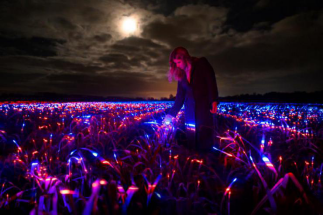<o:p>&nbsp;</o:p>

<o:p>&nbsp;</o:p>

<o:p>&nbsp;</o:p>

-Ultraviolet light<o:p></o:p>

messages, written by the special paint, only become visible in UV light, and also it kills harmful bacteria inside<o:p></o:p>

<o:p>&nbsp;</o:p>
<h2><b>Energy</b><b><o:p></o:p></b></h2>
Bio fuel<o:p></o:p>

Biophotovoltaic devices and plant microbial fuel cells can generate electricity from microorganisms in a variety of environments<o:p></o:p>

生物光伏设备和植物微生物燃料电池可以在多种环境下从微生物中发电<o:p></o:p>

Julia&#769;n Rodri&#769;guez Jirau<o:p></o:p>

<a href="https://www.instagram.com/bio_id/" ><u>https://www.instagram.com/bio_id/</u></a><o:p></o:p>

<o:p>&nbsp;</o:p>

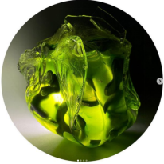<o:p>&nbsp;</o:p>
<h2><b>Material </b><b><o:p></o:p></b></h2>
Bricks Grown From Bacteria<o:p></o:p>

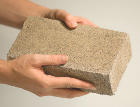<o:p>&nbsp;</o:p>

https://www.archdaily.com/472905/bricks-grown-from-bacteria<o:p></o:p>

<o:p>&nbsp;</o:p>
<h2><b>INNER LOGIC</b><b><o:p></o:p></b></h2>
-(共生模式)促进甜甜圈经济模式<o:p></o:p>

实验装置是作为共生系统的检测计。<o:p></o:p>

实验装置作为一种触发器或者信息收集器，能够采集数据信息。作为集群智能，从而达到对生物性能的了解和研究。在rewilding 的过度中，这种东西解决出现的动物和人类原始遗迹（工业废区等）以及人类活动的冲突<o:p></o:p>

The experimental device is used as a detection meter for symbiotic systems.<o:p></o:p>

The experimental device acts as a trigger or information collector and is able to collect data - as clustered intelligence. This leads to the understanding and study of biological performance. In the accesses of rewilding, such things resolve conflicts between emergent animals and primitive human remains (industrial waste areas etc.) and human activities<o:p></o:p>

<o:p>&nbsp;</o:p>
<h2><b>Precedents（Their researches related to my topic）</b><b><o:p></o:p></b></h2>
At the same time, global <b>remote-working patterns</b>&nbsp;have led to <b>an informal wilding</b>&nbsp;as new ecosystems start to take hold in previously manicured, dense urban areas. Studio 7 wants to know; where are city dwellers escaping to? And what type of urban landscape is left behind for those who cannot leave or choose to stay? In asking these questions, new speculative scenarios start to emerge.<o:p></o:p>

<a href="https://www.instagram.com/p/CGSliGmMZH6/" ><u>https://www.instagram.com/p/CGSliGmMZH6/</u></a><o:p></o:p>

<o:p>&nbsp;</o:p>

<o:p>&nbsp;</o:p>

<o:p>&nbsp;</o:p>

<b>Design Studio 3&nbsp;重塑都市</b><o:p></o:p>

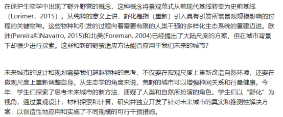<o:p>&nbsp;</o:p>

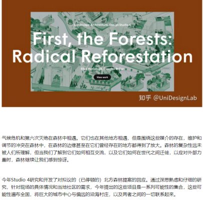<o:p>&nbsp;</o:p>

<a href="https://zhuanlan.zhihu.com/p/332461242" ><u>https://zhuanlan.zhihu.com/p/332461242</u></a><o:p></o:p>

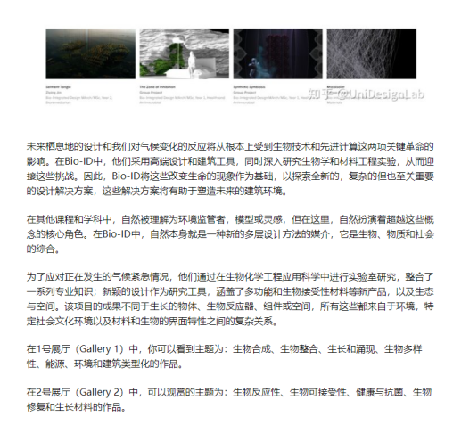<o:p>&nbsp;</o:p>

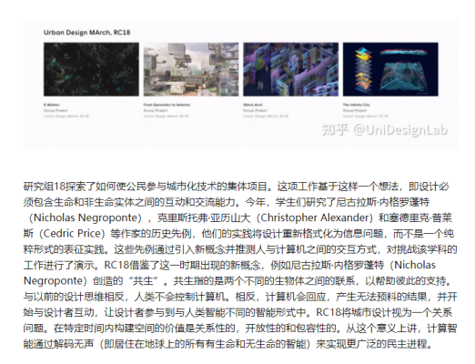<o:p>&nbsp;</o:p>

<!--EndFragment--></body></html>
